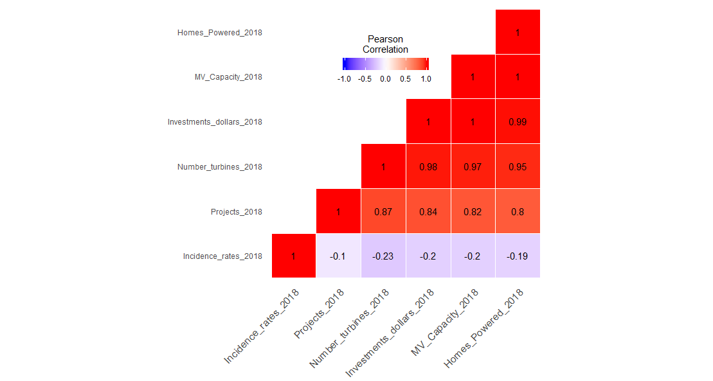
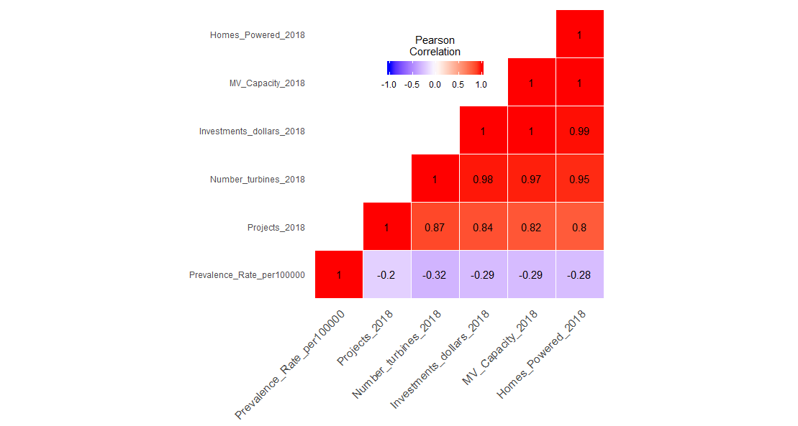

# Cancer Rates are not correlated with Wind Energy in the United States: A state-level analysis
I provide the data and code to conduct a state-level correlation analysis between Wind Energy and Cancer Indicators in the United States using the latest data available.

# Citation
| Santos-Lozada, Alexis R. (2019). Cancer Rates are not correlated with Wind Energy in the U.S.: A State-level analysis. *GitHub*.

# Measurement
## Wind Energy 
I measure Wind Energy using 5 indicators:

* Number of Projects,
* Number of Turbines, 
* Investiment Dollars,
* MV Capacity, and
* Homes Powered.

## Cancer
I measure cancer using three indicators:
* Incidence Rates
* Prevalence Rates
* Death Rates

# Results
Here I provide a visualization of the correlation analysis. All the Wind Energy Indicators are correlated among themselves. No correlation is found between any of the Wind Energy Indicators and the cancer indicators. Although the correlation is not strong, and it is in the opposite direction; this may be due to the characteristics of the states that are embracing Wind Energy. 

## Incidence Rate

## Prevalence Rate

## Death Rates

The code includes a section for an analysis that excludes Texas (an outlier). 

# Conclusion 
There is no correlation between Wind Energy indicators and any of cancer indicators at the state-level. 

# Future directions
Numerous limitations need to be addressed this is a state-level analysis. Future analyses could study whether this association exists at the county level, or if the association/correlation exists with individual data and distance to the turbines. 

# Data Sources
Data for Incidence, Prevalence, and Mortality come from the [**State Cancer Profiles**](https://statecancerprofiles.cancer.gov/).
Data for Wind Energy Indicators come from the [**American Wind Energy Association**](https://www.awea.org/).

# Software
All analyses and visualization can be run with [R](https://www.r-project.org/). R is a free software environment for statistical computing and graphics. It compiles and runs on a wide variety of UNIX platforms, Windows and MacOS.

# Metadata
This repository is managed by [Dr. Alexis R. Santos](ars39@psu.edu). If you have any suggestions feel free to contact me.
